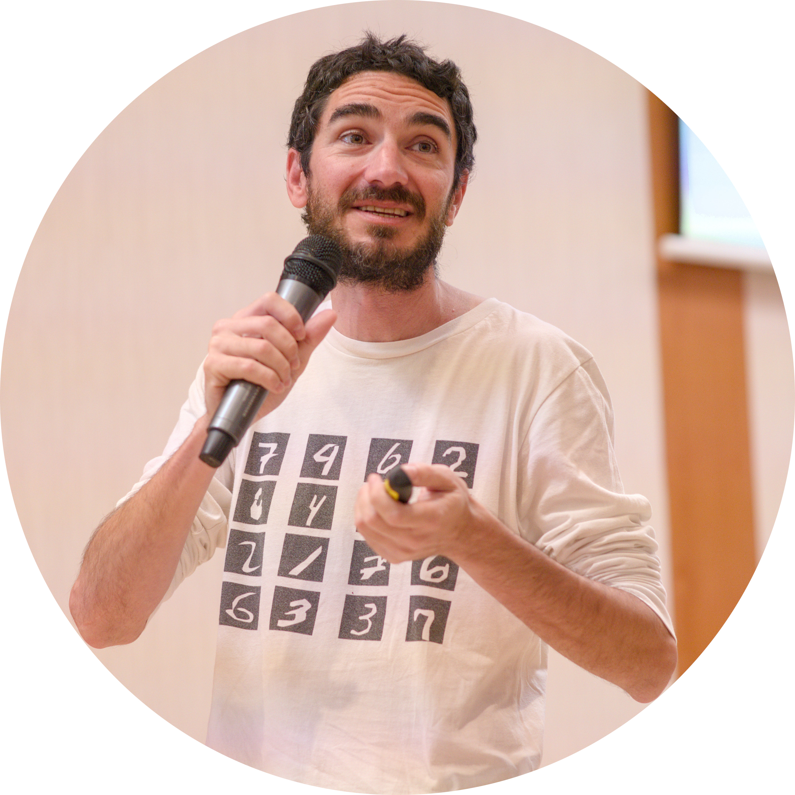

{width=100%}

The NeurIPS 2026 Workshop on AI for Chip Design is organized by researchers from academia and industry working at the intersection of machine learning, electronic design automation, and semiconductor systems.

## Organizing Committee

::: {.columns}

::: {.column}

{width=150}

### Dario Garcia-Gasulla

Barcelona Supercomputing Center (BSC)

[Google Scholar](https://scholar.google.com/citations?hl=en&user=gBe4uPgAAAAJ)

---

### Gokcen Kestor

Barcelona Supercomputing Center (BSC)

[Google Scholar](https://scholar.google.com/citations?user=KkMYGc0AAAAJ)

---

### Emanuele Parisi

Barcelona Supercomputing Center (BSC)

[Google Scholar](https://scholar.google.com/citations?hl=en&user=1BDOgo0AAAAJ)

:::

::: {.column}

### Zhiyao Xie

Hong Kong University of Science and Technology (HKUST)

[Google Scholar](https://scholar.google.com/citations?hl=en&user=fWDDkkgAAAAJ)

---

### Luca Benini

ETH Zürich & Università di Bologna

[Google Scholar](https://scholar.google.com/citations?hl=en&user=8riq3sYAAAAJ)

---

### Leighanne Clevenger

Silicon Integration Initiative (Si2)

[Google Scholar](https://scholar.google.com/citations?hl=en&user=NtlHISkAAAAJ)

---

### Cong (Callie) Hao

Georgia Institute of Technology

[Google Scholar](https://scholar.google.com/citations?hl=en&user=fWEIPSUAAAAJ)

:::

:::
