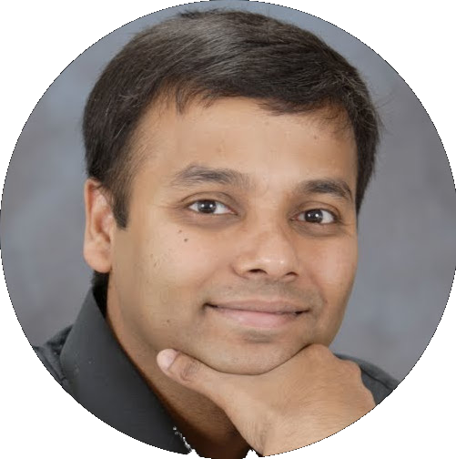
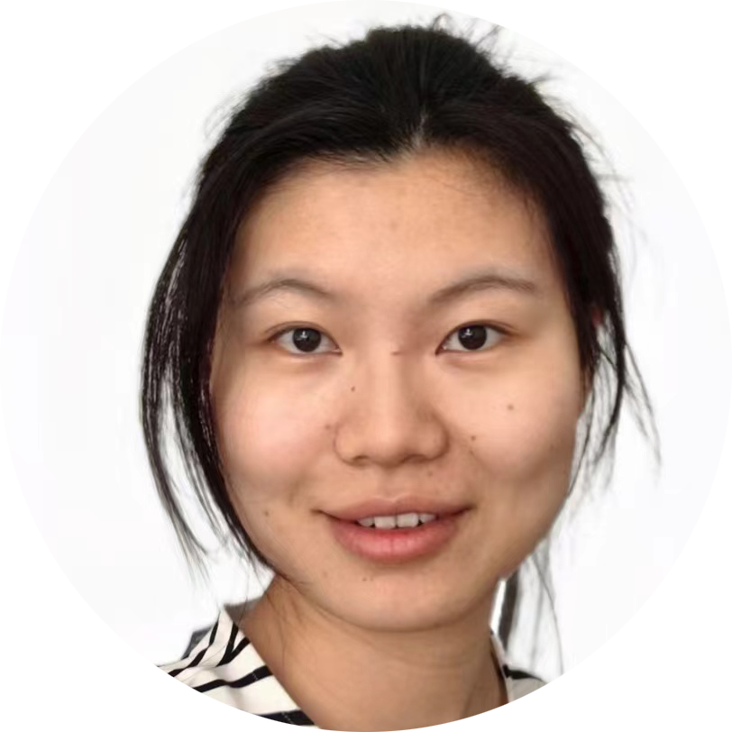

{width=100%}

## Confirmed Speakers

::: {.speaker-card}

{width=150px}

::: {.speaker-info}

**Subhasish Mitra** — *Stanford University*

:::

William E. Ayer Endowed Chair Professor of EE and CS, directing the Stanford Robust Systems Group and working on the leadership team of the Microelectronics Commons AI Hardware Hub. Fellow of the ACM and IEEE.

**Talk: “New AI-Ready Verification Enables AI-Boosted Chip Design"**

:::

::: {.speaker-card}

{width=150px}

::: {.speaker-info}

**Xing Hu** — *Institute of Computing Technology, Chinese Academy of Sciences*

:::

Associate professor working at the intersection of computer architecture and machine learning, with a focus on efficient, robust AI systems and AI-driven chip design.

**Talk: “Qimeng: Chip Design in the Age of Foundation Models”**

:::

Additional speakers will be announced soon.

